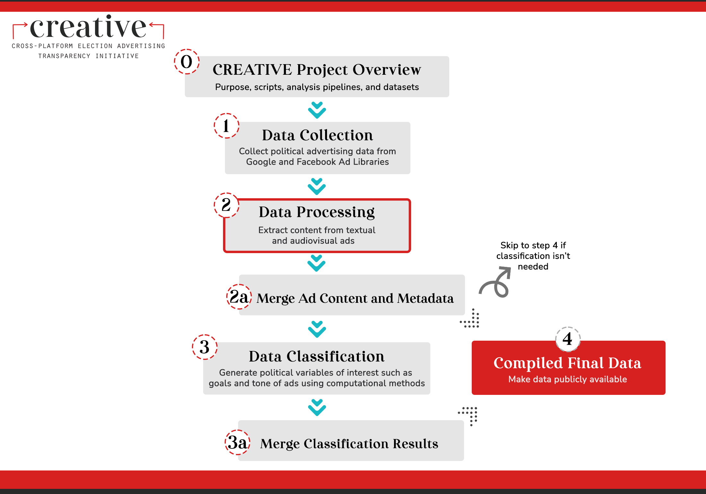

# CREATIVE --- AWS Rekognition Image & Video Processing

Welcome! This repo contains scripts for performing image and video recognition on political ads through the Amazon Rekognition service (AWS SDK for Python).

This repo is a part of the [Cross-platform Election Advertising Transparency Initiative (CREATIVE)](https://www.creativewmp.com/). CREATIVE has the goal of providing the public with analysis tools for more transparency of political ads across online platforms. In particular, CREATIVE provides cross-platform integration and standardization of political ads collected from Google and Facebook. CREATIVE is a joint project of the [Wesleyan Media Project (WMP)](https://mediaproject.wesleyan.edu/) and the [privacy-tech-lab](https://privacytechlab.org/) at [Wesleyan University](https://www.wesleyan.edu).

To analyze the different dimensions of political ad transparency we have developed an analysis pipeline. The scripts in this repo are part of the Data Processing step in our pipeline.



## Table of Contents

- [1. Overview](#1-overview)
- [2. Setup](#2-setup)
- [3. Code Structure](#3-code-structure)
- [4. Results Storage](#4-results-storage)
- [5. Thank you!](#5-thank-you)

## 1. Overview

This repo contains scripts for performing image and video recognition on political ads through the Amazon Rekognition service (AWS SDK for Python). The core functionality that the scripts in this repo provide are:

- A video processing module calling the Amazon Rekognition video API to perform text detection, label detection, face detection and face search (searching for faces that match an existing face collection) on video data. The module also provides functions to create [Simple Notification Service](https://docs.aws.amazon.com/sns/latest/dg/welcome.html) (SNS) topic and [Simple Queue Service](https://docs.aws.amazon.com/AWSSimpleQueueService/latest/SQSDeveloperGuide/welcome.html) (SQS) queue necessary for Rekognition video analysis.
- An image processing module calling the Amazon Rekognition image API to perform text detection, face detection, and face search on image data.
- Functions in video and image modules that allow one-step parsing of WMP variables from Rekognition image and video analysis results: Four separate functions parse the standard response data of face/text detection and facial recognition into these four columns in our final 2022 political advertising data: `aws_ocr_img_text` (image ads), `aws_face_img` (image ads), `aws_face_vid` (video ads), `aws_ocr_video_text` (video ads). 
- Code for creating a face collection with Rekognition, which is necessary to run face search for both image and video processing.
- Tutorial notebooks to use the above modules and functions ([video processing tutorial](https://github.com/Wesleyan-Media-Project/aws-rekognition-image-video-processing/blob/main/code/video/tutorial.ipynb), [image processing tutorial](https://github.com/Wesleyan-Media-Project/aws-rekognition-image-video-processing/blob/main/code/image/tutorial.ipynb).

For background information, please consult the workflow description of [Amazon Rekognition image and video pipelines](https://github.com/aws-samples/amazon-rekognition-serverless-large-scale-image-and-video-processing/blob/main/README.md) by AWS. 

## 2. Setup

Before running any of the code in this repo, make sure you have Python installed on your system. You can download Python from the [official Python website](https://www.python.org/downloads/). In addition, install Jupyter Notebook by writing the following command in your terminal:

```bash
pip install jupyter
```

From here, you should be able to run Jupyter Notebook with:

```bash
jupyter notebook
```

Also, install the following dependency:

```bash
pip install boto3
```

You will need to [register for an AWS account](https://aws.amazon.com/). Once you registered your account, proceed as follows:

1. Create an Amazon S3 bucket to store the video and image data for processing via your AWS account ([instructions to create an Amazon S3 bucket](https://docs.aws.amazon.com/AmazonS3/latest/userguide/create-bucket-overview.html)).

2. Create your [IAM role](https://docs.aws.amazon.com/IAM/latest/UserGuide/id_roles.html) following [this instruction](https://docs.aws.amazon.com/IAM/latest/UserGuide/id_roles_create_for-user.html).

3. Configure your [AWS credentials](https://docs.aws.amazon.com/cli/latest/userguide/cli-chap-configure.html) in the environment where you will run the image and video analysis using your *access key* and *secret access key* (create your access keys first following [this instruction](https://docs.aws.amazon.com/IAM/latest/UserGuide/id_credentials_access-keys.html).

4. After the above setup procedures, please follow the instructions in the `/code/getting-started` folder, which contains code samples, to upload data to the S3 bucket and create face collections.

   ```bash
   # Upload your face collection data, image data, video data from their local paths to respective Amazon S3 bucket destinations
   aws s3 cp <source> <target> --recursive % Replace the source and target with your local source directory and the target directory on S3
   ```

5. After you have your data stored in an S3 bucket, follow the tutorials in the `/code/image` and `/code/video` folders to process the data based on your demands. Make sure to replace the placeholders in the code with your own AWS credentials and file paths.

## 3. Code Structure 
You may simply refer to the image and video tutorial notebooks linked in the overview section and here to use the image and video ads processing modules in this repo. But if you would like to understand more about these modules, the following diagram illustrates the structure of the `code/` directory of this repo, the workflow, and the functionalities of each module. The first step is `code/getting-started` where you upload image and video data and create a face collection (for facial recognition purpose). 

It branches into an image and a video module. An image module takes in a .jpg or .png file as input, perform different types of image analysis based on user's needs (extract text, faces or facial recognition). Then it offers instructions to store the Amazon Rekognition Image response data in an Amazon S3 bucket and utility functions to parse the reponses into WMP variables (`aws_ocr_img_text` and `aws_face_img`) that appear in our final datasets. Tutorial for using the image module is [here](https://github.com/Wesleyan-Media-Project/aws-rekognition-image-video-processing/blob/main/code/image/tutorial.ipynb). 

Similarly, the video module takes a video file as input and allows functionalities of text/face detection and facial recognition. It also provides utility functions to store the data locally or in an S3 bucket and to parse the Amazon Rekognition Video reponse data into WMP variables (`aws_ocr_video_text` and `aws_face_vid` -- columns in our final data for 2022 political advertising). The difference is that for Rekognition video analysis, we need to set up an SNS Topic and an SQS Queue first ([see pipeline reference from Amazon here](https://github.com/aws-samples/amazon-rekognition-serverless-large-scale-image-and-video-processing)). Tutorial for using the video module is [here](https://github.com/Wesleyan-Media-Project/aws-rekognition-image-video-processing/blob/main/code/video/tutorial.ipynb). 


## 4. Results Storage

Image and video processing modules return the response data from the Amazon Rekognition API in a dictionary. They can be saved into JSON files. You may choose to either store the raw response data in Amazon S3 bucket or in your local machine. To store them in an S3 bucket, see the `tutorial.ipynb` in the `/code/image` and `/code/video` folders.

We also provide helper functions that parse WMP variables from the response data.

These WMP variables parsed from Rekognition response data are saved as columns `aws_ocr_img_text` (image ads), `aws_face_img` (image ads), `aws_face_vid` (video ads), `aws_ocr_video_text` (video ads) into our final output tables. Description and access information of final output tables can be found in [data-post-production](https://github.com/Wesleyan-Media-Project/data-post-production/tree/main).

## 5. Thank You

<p align="center"><strong>We would like to thank our supporters!</strong></p><br>

<p align="center">This material is based upon work supported by the National Science Foundation under Grant Numbers 2235006, 2235007, and 2235008.</p>

<p align="center" style="display: flex; justify-content: center; align-items: center;">
  <a href="https://www.nsf.gov/awardsearch/showAward?AWD_ID=2235006">
    
  </a>
</p>

<p align="center">The Cross-Platform Election Advertising Transparency Initiative (CREATIVE) is a joint infrastructure project of the Wesleyan Media Project and privacy-tech-lab at Wesleyan University in Connecticut.

<p align="center" style="display: flex; justify-content: center; align-items: center;">
  <a href="https://www.creativewmp.com/">
    
  </a>
</p>

<p align="center" style="display: flex; justify-content: center; align-items: center;">
  <a href="https://mediaproject.wesleyan.edu/">
    
  </a>
</p>

<p align="center" style="display: flex; justify-content: center; align-items: center;">
  <a href="https://privacytechlab.org/" style="margin-right: 20px;">
    
  </a>
</p>
